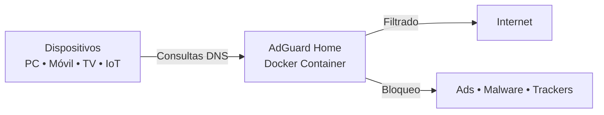

# 🛡️ AdGuard Home DNS Sinkhole con Docker

[](https://www.docker.com/)
[](https://ubuntu.com/)
[]()
[]()
[]()

> Implementación profesional de un **DNS Sinkhole con AdGuard Home** usando **Docker Compose** para centralizar el bloqueo de anuncios, rastreadores y malware en toda una red local.

---


## 🧭 Arquitectura del Sistema



---

## 🧰 Stack Tecnológico

- **OS:** Ubuntu Server 20.04 / 22.04  
- **Contenedores:** Docker + Docker Compose  
- **DNS Sinkhole:** AdGuard Home  
- **Infraestructura:** IaC  

---

## 📁 Estructura del Proyecto

```
adguard-project/
├── docker-compose.yml
├── .gitignore
├── workdir/     # Datos runtime (ignorado)
└── confdir/     # Configuración persistente (ignorado)
```

---

## 🚀 Instalación

### 1️⃣ Liberar el puerto 53

```bash
sudo nano /etc/systemd/resolved.conf
```

```ini
DNSStubListener=no
```

```bash
sudo systemctl restart systemd-resolved
sudo rm /etc/resolv.conf
sudo ln -s /run/systemd/resolve/resolv.conf /etc/resolv.conf
```

---

### 2️⃣ Docker Compose

```bash
mkdir adguard-project && cd adguard-project
```

```yaml
services:
  adguardhome:
    image: adguard/adguardhome
    container_name: adguardhome
    restart: unless-stopped
    volumes:
      - ./workdir:/opt/adguardhome/work
      - ./confdir:/opt/adguardhome/conf
    ports:
      - "53:53/tcp"
      - "53:53/udp"
      - "80:80/tcp"
      - "3000:3000/tcp"
```

```bash
docker compose up -d
```

---

## 👤 Autor

**Jan Cobian**  
Ingeniero en Sistemas Computacionales  
📍 México  


---

## 🔑 ¿Cómo acceder a AdGuard Home (El "Guardián")?

Una vez que el contenedor esté corriendo, puedes acceder a la interfaz web del **Guardián (AdGuard Home)** así:

### 🌐 Acceso desde el navegador

En cualquier dispositivo de tu red escribe:

```
http://IP_DEL_SERVIDOR
```

o bien (para el asistente inicial):

```
http://IP_DEL_SERVIDOR:3000
```

📌 Ejemplo:
```
http://192.168.1.100
```

### 👤 Acceso al Panel de Administración

- Usuario: el que creaste en el wizard inicial  
- Contraseña: la que configuraste al instalar

### 🧭 Rutas importantes dentro del panel

- 📊 **Dashboard:** Vista general del tráfico DNS  
- 🔍 **Registro de consultas:** Auditoría de red  
- 🚫 **Filtros → Servicios bloqueados:** Bloqueo de redes sociales  
- 👶 **Configuración → Filtros:** Control parental y SafeSearch  
- 📋 **Listas de bloqueo DNS:** Gestión de blocklists  

---

